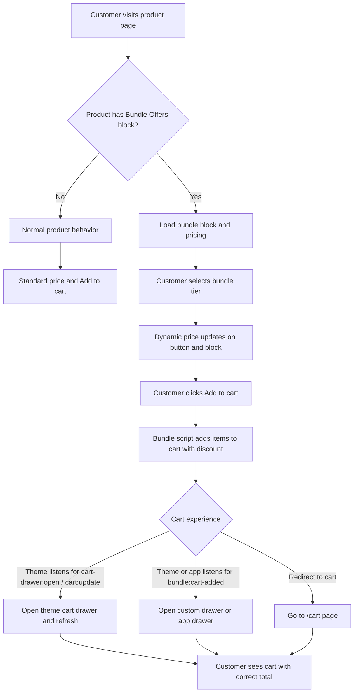

# Shopify Bundle Offers Widget v2

Theme-agnostic Shopify bundle widget with **dynamic pricing** and an **enhanced add-to-cart button**. Works with any Online Store 2.0 theme and with **any cart drawer**—native theme drawer, custom drawer, or cart drawer app.

---

## Features

- **Multi-tier bundle offers** – e.g. Buy 1, Buy 2 Get 1 Free, Buy 3 Get 2 Free
- **Dynamic pricing** – Prices update when the customer selects a bundle tier
- **Free gifts** – Automatically add free gift products and optional discount codes
- **Enhanced add-to-cart button** – Optional button that shows the selected bundle price and updates on selection
- **Cart-agnostic** – Fits any cart experience: native theme drawer, custom drawer, cart drawer app, or redirect to cart

---

## Compatibility

- **Shopify:** Online Store 2.0 (section/block support)
- **Themes:** Any theme (premium or custom) that has a product template with a product form
- **Cart:** Any cart drawer (native, custom, or app); or redirect to `/cart`

---

## Architecture Flow

**Summary:** When the product has the Bundle Offers block, the widget loads, updates the displayed price when a tier is selected, and on add-to-cart sends the right items and discount. The store’s theme or app then decides how to show the cart (drawer or redirect) by listening to the events the widget dispatches.

---

## Installation

1. Copy the contents of `theme-files/` into your theme root (e.g. `blocks/`, `assets/`, `snippets/`).
2. In the theme editor, add the **Bundle Offers** block to your product section (product template).
3. Configure bundle tiers, pricing, free gifts, and badges in the block settings.
4. Ensure the product form has an Add to cart button; the bundle script will intercept it.

Optional:

- Use the **Enhanced add-to-cart** snippet so the button shows the dynamic bundle price (see [Installation guide](docs/installation.md)).
- For **cart drawer integration** (native, custom, or app), see [Cart drawer integration](docs/cart-drawer-integration.md).

Detailed steps: [docs/installation.md](docs/installation.md)

---

## Cart drawer: works with any setup

The widget does **not** assume a specific cart drawer. After adding to cart it:

1. Dispatches **`cart-drawer:open`** (optional loading state) and **`cart:update`** (with section HTML when requested).
2. Dispatches **`bundle:cart-added`** with `{ cart, itemCount, sections }` so any theme or app can open or refresh its drawer.

| Your setup | What to do |
|------------|------------|
| **Native theme drawer** | If the theme already listens for `cart-drawer:open` and `cart:update`, no extra code. Optionally set **Cart section IDs** in the block if your theme uses different section IDs. |
| **Custom drawer** | Listen for `bundle:cart-added`; open your drawer and update it from `e.detail.cart` (and `e.detail.sections` if you use section HTML). |
| **Cart drawer app** | Have the app listen for `bundle:cart-added` and refresh/open its drawer using `e.detail.cart` or `e.detail.sections`. |
| **Redirect to cart** | Listen for `bundle:cart-added` and set `window.location.href = '/cart'`. |

Optional **theme cart display** updates (e.g. cart heading, bubble count) only run if you include the optional `bundle-cart-adapter` snippet; see [Cart drawer integration](docs/cart-drawer-integration.md).

---

## Theme files included

| Path | Description |
|------|-------------|
| `theme-files/blocks/product-bundle-offers.liquid` | Bundle block (tiers, badges, pricing, free gifts). |
| `theme-files/assets/bundle-offers-v2.js` | Cart-agnostic bundle logic and add-to-cart. |
| `theme-files/assets/enhanced-add-to-cart.js` | Dynamic price on the add-to-cart button. |
| `theme-files/snippets/add-to-cart-button-enhanced.liquid` | Optional enhanced add-to-cart button snippet. |
| `theme-files/snippets/bundle-cart-adapter.liquid` | Optional adapter for theme cart display updates. |

---

## Block settings (overview)

- **General:** Show product image, free gift image.
- **Badge:** Design (circle, tag, shield, etc.), animation (shimmer, gradient), size, text color, vertical position; mobile overrides.
- **Cart integration (optional):** **Cart section IDs** – comma-separated section IDs to request when adding to cart (e.g. `cart-drawer`, `main-cart`). Leave blank to auto-detect from the theme.
- **Per tier:** Enable, title, quantity, price type (percentage or fixed), discount code, free gift product and quantity, optional “display” free gift, badges and colors.

---

## Docs

- [Installation](docs/installation.md)
- [Cart drawer integration](docs/cart-drawer-integration.md)

---

## Version

**v2** – Cart-agnostic; works with any theme and any cart drawer (native, custom, or app).
