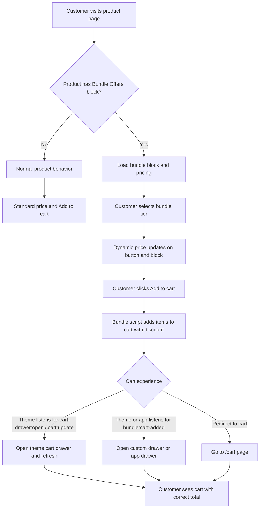

# 🎁 Shopify Bundle Offers Widget v2

A **theme-agnostic** bundle widget for Shopify – dynamic pricing, free gifts, and an enhanced add-to-cart button. Works with **any Online Store 2.0 theme** and **any cart drawer** (native, custom, or app). Production-ready and easy to install on client stores.

[](https://www.shopify.com) [](https://shopify.dev/docs/api/liquid) [](https://developer.mozilla.org/en-US/docs/Web/JavaScript)

---

## 📸 Visual Preview

*Add a screenshot or short video here showing the bundle widget on a product page (tiers, pricing, badges) and the enhanced add-to-cart button. You can also add a second image for mobile view.*

| Bundle widget on product page | Enhanced add-to-cart button |
|-------------------------------|-----------------------------|
| *[Screenshot or GIF: bundle options with radio buttons, prices, free gift indicators]* | *[Screenshot: button with dynamic price and guarantee text]* |

**Demo video**  
*Optional: link to a short screen recording – e.g. “User selects bundle → price updates → adds to cart → cart drawer opens.”*

---

## ✨ Key Features

### 🎯 Bundle system
- **Multi-tier offers** – e.g. Buy 1, Buy 2 Get 1 Free, Buy 3 Get 2 Free
- **Flexible pricing** – Percentage discount or fixed price per tier
- **Dynamic price display** – Updates when the customer selects a tier
- **Free gifts** – Attach free products to any tier; optional discount codes
- **Customizable badges** – Design, animation (shimmer, gradient), size, position; mobile overrides

### 🛒 Enhanced add-to-cart button (optional)
- **Dynamic price** – Shows selected bundle price with optional compare-at price
- **Customizable copy** – Button text, guarantee line, separator
- **Theme customizer** – Colors, padding, font size, border radius

### 🔌 Cart-agnostic (v2)
- **Any theme** – No hard-coded cart selectors; works with native, custom, or app drawers
- **Events** – Dispatches `bundle:cart-added` with cart JSON and section HTML so your theme or app can open/refresh the drawer
- **Optional adapter** – Include `bundle-cart-adapter` snippet for simple theme cart display updates (heading, bubble count)

### 🚀 Developer-friendly
- **Clean structure** – Root `assets/`, `blocks/`, `snippets/`, `docs/` (same layout as v1 repo)
- **Event-driven** – Integrate with any cart or app via `bundle:cart-added`
- **Documented** – Installation, cart drawer integration, architecture diagram
- **No dependencies** – Vanilla JavaScript, no external libraries

---

## 📦 What's Included

```
shopify-bundle-offers-widget-v2/
├── blocks/
│   └── product-bundle-offers.liquid    # Main bundle widget block
├── snippets/
│   ├── add-to-cart-button-enhanced.liquid  # Optional enhanced button
│   └── bundle-cart-adapter.liquid          # Optional cart display adapter
├── assets/
│   ├── bundle-offers-v2.js              # Bundle logic & cart-agnostic add-to-cart
│   └── enhanced-add-to-cart.js          # Button price update logic
├── docs/
│   ├── installation.md                 # Step-by-step installation
│   └── cart-drawer-integration.md       # Native / custom / app cart integration
├── README.md                            # This file
├── GETTING_STARTED.md                   # Quick install path
├── START_HERE.md                        # Entry point for new users
├── CHANGELOG.md                         # v2 changes
└── LICENSE                              # MIT
```

---

## 🚀 Quick Start

1. **Copy files** into your theme root:
   - `blocks/product-bundle-offers.liquid` → `blocks/`
   - `assets/bundle-offers-v2.js` → `assets/`
   - `assets/enhanced-add-to-cart.js` → `assets/`
   - Optionally: `snippets/add-to-cart-button-enhanced.liquid`, `snippets/bundle-cart-adapter.liquid` → `snippets/`

2. **Add the block** – Theme editor → Product page → Add block → **Bundle Offers**. Configure tiers, pricing, free gifts, badges.

3. **Add to cart** – Ensure the product form has an Add to cart button; the bundle script intercepts it. For dynamic price on the button, use the enhanced snippet (see [docs/installation.md](docs/installation.md)).

4. **Cart** – Works with redirect to `/cart` out of the box. For drawer integration, see [Cart drawer integration](docs/cart-drawer-integration.md).

Full steps: [GETTING_STARTED.md](GETTING_STARTED.md) · [docs/installation.md](docs/installation.md)

---

## 🧩 How It Works – Architecture Flow



**Summary:** The widget loads on product pages that use the Bundle Offers block, updates the displayed price when a tier is selected, and on add-to-cart sends the correct items and discount. Your theme or app then decides how to show the cart (drawer or redirect) by listening to the events the widget dispatches.

*Optional: add a short video or GIF here showing the flow from selection → price update → add to cart → cart drawer.*

---

## 🛒 Cart Drawer – Works With Any Setup

The widget does **not** assume a specific cart. After adding to cart it dispatches events; your theme or app handles the rest.

| Your setup | What to do |
|------------|------------|
| **Native theme drawer** | If the theme already listens for `cart-drawer:open` and `cart:update`, often no extra code. Optionally set **Cart section IDs** in the block. |
| **Custom drawer** | Listen for `bundle:cart-added`; open your drawer and update from `e.detail.cart` and/or `e.detail.sections`. |
| **Cart drawer app** | App listens for `bundle:cart-added` and refreshes/opens its drawer using `e.detail.cart` or `e.detail.sections`. |
| **Redirect to cart** | Listen for `bundle:cart-added` and set `window.location.href = '/cart'`. |

Optional theme cart display (heading, bubble count) only runs if you include the `bundle-cart-adapter` snippet – see [Cart drawer integration](docs/cart-drawer-integration.md).

---

## 📚 Code Documentation

### JavaScript events

**`bundle:cart-added`** – Use this for custom or app-based cart drawers.

```js
document.addEventListener('bundle:cart-added', (e) => {
  const { cart, itemCount, sections } = e.detail;
  // cart: full cart JSON from /cart.js
  // itemCount: number of items
  // sections: { [sectionId]: htmlString } if section IDs were requested
});
```

**`bundle:selected`** – Fired when a bundle tier is selected (for custom integrations).

```js
document.addEventListener('bundle:selected', (event) => {
  // event.detail: price, comparePrice, quantity, formattedPrice, freeGiftVariantId, freeGiftQuantity
});
```

### Block settings (overview)

- **General:** Product image, free gift image.
- **Badge:** Design (circle, tag, shield, etc.), animation (shimmer, gradient), size, text color, vertical position; mobile overrides.
- **Cart (optional):** Cart section IDs – comma-separated section IDs to request when adding to cart.
- **Per tier:** Enable, title, quantity, price type (percentage/fixed), discount code, free gift, badges, colors.

---

## 🧪 Testing Checklist

- [ ] Bundle selection updates the button price
- [ ] Quantity input syncs with bundle selection
- [ ] Free gifts are added to cart correctly
- [ ] Cart drawer opens or redirect to cart works after add
- [ ] Cart shows correct quantities and prices
- [ ] Mobile layout and badge overrides work
- [ ] Works with variant selector (e.g. size/color)

---

## 🐛 Troubleshooting

| Issue | What to try |
|-------|-------------|
| Button price not updating | Ensure `enhanced-add-to-cart.js` is loaded and the product form uses the enhanced snippet or has the expected selectors. |
| Cart drawer not updating | Theme must listen for `cart-drawer:open` / `cart:update` or for `bundle:cart-added`. Set **Cart section IDs** in the block if your theme uses specific section IDs. See [Cart drawer integration](docs/cart-drawer-integration.md). |
| Free gifts not adding | Check free gift product is published and in stock; variant ID in block settings is correct. |

More: [docs/installation.md](docs/installation.md) · [docs/cart-drawer-integration.md](docs/cart-drawer-integration.md)

---

## 📄 License

This project is free to use for personal and commercial projects. See [LICENSE](LICENSE) (MIT). Attribution appreciated but not required.

---

## 💬 Support

- **Docs:** [GETTING_STARTED.md](GETTING_STARTED.md), [docs/](docs/)
- **Issues:** Open an issue on GitHub
- **Contact:** rsusano123s@gmail.com

---

**v2** – Cart-agnostic; works with any theme and any cart drawer.  
⭐ Star this repo if you find it helpful.
